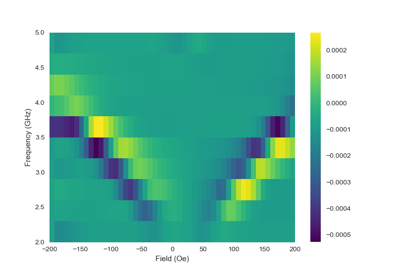

## Welcome to the FMR experiment at the Spin Lab!

This code will help you operate the FMR setup located in the Spin Lab at the Department of Physics at the Lahore University of Management Sciences. The code uses `pyvisa` to operate the following three instrumnts:

- The [SRS SR830](https://www.thinksrs.com/products/sr810830.htm) Lock-In Amplifier
- The [Kepco BOP 50-8D](https://www.kepcopower.com/bopmod.htm) Power Supply
- The [HP 8673G](https://www.testwall.com/product/agilent-hp-8673g/) (official website unavailable) Signal Generator

All instruments are connected via GPIB and are daisy-chained to a PC with an installed NI PCIe-GPIB+ card.

For more information, feel free to go through the `tutorial.ipynb` file.

### Acknowledgement

This code is based on the code of Dr Diego González Chávez at the Centro Brasileiro de Pesquisas Físicas. Find his repository [here](https://github.com/Vrekrer/magdynlab).